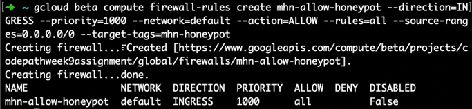

# honeypot-week9

Milestone 1: Create MHN Admin VM

This first command was run to create a firewall rule allowing ingress traffic to come in on TCP ports 3000 and 10000. 
 

The second command created the Virtual Machine. 
 

However, I had to change the zone and region to “east4-b” and “east4” respectively, because I kept getting this error: 
 

I then established the SSH access to the VM with “gcloud compute ssh mhn-admin”.

Milestone 2: Install the MHN Admin Application

I ran the relevant commands to install the Admin application. I updated and installed git, then cloned the MHN code into /opt and ran intall.sh.
 

I then loaded the external IP address in a browser after changing the firewall rule details to allow TCP 80 ingress in addition to 10000 and 3000. 
 

Milestone 3: Create a MHN Honeypot VM

I first created a firewall rule allowing incoming traffic on all ports:
 

Then I created the VM for the honeypot: mhn-honeypot-1:
 

I then ssh’ed into the vm with “gcloud compute ssh mhn-honeypot-1”.

Milestone 4: Install the Honeypot Application

I logged into the admin console, clicked “Deploy” and chose the script “ubunto – Dionaea with HTTP”

 
I then copied the Deploy Command and executed it inside the honeypot VM which installed the Dionaea software.

I went back to the admin console, chose to view sensors and saw this new honeypot:
 

Milestone 5: Attack!

I first ran a command nmap with the external IP of the honeypot VM:
 

Back in the admin console, under attacks, I can see that the nmap command was successful and I am able to see that there are many attacks on the honeypot. The honeypot intercepted the attack,along with many other attacks from other IP’s.
 
 

